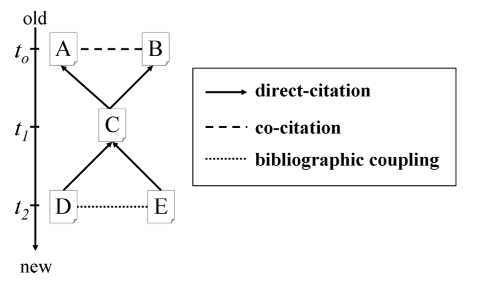

# Methodology {#methodology}

```{r metodologia-completa, echo=FALSE, fig.cap="", out.width = '90%'}
knitr::include_graphics("images/metodologia_completa.png")
```

## Steps 1 to 2 - Collect and organize the  data

To collect the data, we used the Scopus database and construct a query as the following:

```
TITLE-ABS-KEY ((finance OR financial) W/3 
(green OR climate OR carbon OR sustainable)) AND 
(LIMIT-TO (DOCTYPE, "ar") OR LIMIT-TO (DOCTYPE, "ch") OR 
LIMIT-TO (DOCTYPE, "re") OR LIMIT-TO 
(DOCTYPE, "bk")) AND (LIMIT-TO (SRCTYPE, "j"))
```

This data was accessed in September 2021. This query is limited to peer-reviewed articles and article reviews published in journals indexed in the Scopus database. The raw sample with 3663 documents was transferred by *Bibliometrix* to `R` software where we could organize de data as a bib extension.

## Step 3 - Field growth

A descriptive analysis of the sample attests to the strong growth of green finance literature in recent years. However, to deeply understand what this growth properly means, we compared this expansion to the growth of science as a whole.

Considering all the papers and reviews indexed in Scopus from 1990 to 2020 as a proxy of global scientific growth and determining the number of publications per year during the period, the growth model was estimated by nonlinear regression as proposed by [@bornmann2015]:

$$
y(t) = \beta_0 exp (\beta_1 \times(t-1990))
$$

## Step 4 to 8 - Complex Network Analysis

Step 4 corresponds to the bibliographic coupling methodology which is one of the possible methods to build a citation network. To accomplish the objective of understanding the evolution of the green finance domain, it is important to apply a methodology capable to detect emerging research fronts.

According to [@shibata2009] “bibliographic coupling is defined as the edge between two documents citing the same paper(s). If both papers A and B are cited by C, there is a co-citation between A and B. And if both D and E cite F, there is bibliographic coupling between D and E".

```{r shibata2009rede, echo=FALSE, fig.cap="Bibliographics Networks", out.width = '60%'}

```

Step 5 is maintain only the giant component of the network; it means that the isolated documents were excluded. Step 6 corresponds to the clustering process. The clustering process was obtained through the Louvain algorithm method which is able to detect communities in large networks. This method proposed by [@blondel2008]  is a heuristic method based on modularity optimization which allows decomposing a complex network into sub-units or communities with highly connected nodes. Three groups emerged from the clustering process.

## Step 9 - Topological measures by a hub Analysis

Furthermore, a hub analysis was computed to identify the degree of relevance of each document in the network, concerning its group and between groups (in all the network), from indicators introduced by [@guimera2005]. This approach is based on the idea that nodes with the same role should have similar topological properties. This method allows defining heuristically seven different "universal roles" (Figure \@ref(fig:shibata2009rede)). The degree of importance of the group is represented by $z_i$. The degree $z_i$ measures to what extent the $i$ vertexes is connected to the other vertices in the same group $s$, and is calculated as:

\begin{equation}
z_i = {k_i - \bar k_{s_i} \over \sigma_{k_{s_i}}}
(\#eq:zi)
\end{equation}

 in which $k_{s_i}$ is the number of connections of the vertex $i$ to other vertices in its group $s_i$, while $\bar{k}{s_i}$ *is the measure of $k$ on all vertices in the  s_i, and $\sigma{k_{s_i}}$* is the standard diversion of $k$ in $s_i$. The degree of relevance $z_i$ of a vertex in the group is high if the number of connections of the vertex in the group is high.

The participation coefficient $P_i$ between groups shows the degree to which the connections of a vertice $i$ are distributed among different groups $s_i$. This coefficient is obtained by:

\begin{equation}
P_i = 1 - \sum_{s=1}^{S} \left({k_{s_i} \over K_i} \right)^2
(\#eq:pi)
\end{equation}

where  $k_{s_i}$ is the number of connections of the vertex $i$ to other vertices in its group $s_i$, being $S$ the number of groups, and $K_i$ is the total degree of the vertex $i$, that is, the number of edges that the $i$ vertex holds. When the participation coefficient $P_i$ is close to one, it indicates that its connections are distributed evenly between all of the groups. When it is close to zero, this indicates that all of the connections are within their group [@guimera2005].

@guimera2005 applied Equations \@ref(eq:zi) and \@ref(eq:pi) to the networks and heuristically defined seven different rules, illustrated in a space of parameters (see Figure \@ref(fig:zipicolors) ). The classification established by the authors suggests that the vertices with $z \geq 2.5$  are hubs, while the vertices with  $z < 2.5$ are not considered hubs. The vertices that are not considered hubs are divided into 4 groups: ultra peripherals, vertices with the majority of their edges inside their group R1 $(P < 0.05)$; peripherals, vertices with many of their edges inside the group R2 $(0.05 < P \leq 0.62)$; connectors that are not hubs, vertices with a high proportion of edges in other groups R3 $(0.62 <  P \leq 0.80)$; well-distributed vertices, vertices with homogenously distributed edges within the groups R4 $(P > 0.80)$.

Regarding the hub vertices, there are 3 groups: provincial hubs, vertex hubs with the majority of their edges in their group R5 $(P < 0.80)$; connector hubs, vertex hubs with many of their edges in other groups R6 $(0.30 < P \leq 0.75)$; and well-distributed hubs, vertex hubs with their edges homogeneously distributed between the groups R7 $(P > 0.75)$.

In this paper, we do not differentiate the hubs in R5, R6, and R7. Associated with Step 10, we consider all the hubs with a $\gamma>0,7$ ( a measure of belonging to a topic, presented in Section 3.12).

```{r zipicolors, echo=FALSE, fig.cap="ZiPi", out.width = '60%'}

```

## Step 10 - Structure Topic Modelling

The last step was to identify the topics presented in each group through Structure Topic Modelling (STM). Associating it with the hubs analysis, was possible to identify whether each topic was influential or not within the groups and the network.  To achieve this purpose, we consider the hubs from Step 9 for each group.  From the STM, we divided the documents into topics and we selected the hubs that strongly belonged to each topic - each document can belong to one or more topics and this is measured by $\gamma$ (Section 3.12).

<!-- 
[Topic Modeling in R With tidytext and textmineR Package (Latent Dirichlet Allocation)](https://medium.com/swlh/topic-modeling-in-r-with-tidytext-and-textminer-package-latent-dirichlet-allocation-764f4483be73)

[](https://mran.revolutionanalytics.com/snapshot/2020-04-25/web/packages/stm/stm.pdf)
-->

Topic Modelling is a type of statistical model for discovering topics that occur in a set of documents finding semantic structures hidden in a text body. The topics that emerge from this technique are "clusters" of similar words. STM is a type of topic model, being a generative model of word counts that means that a data generating process is created for each document and then this data is used to find the most likely values for the parameters within the model [@roberts2019].

The Figure \@ref(fig:stm), extracted from @roberts2019, presents the steps of the STM methodology. First, the generative model is created by the distribution within document-topic and topic-word creating documents that have metadata associated with them ($X_d$ where $d$ indexes the documents). In this framework, a topic is created by the combination of words where each word has a probability associated with a topic. Furthermore, a document is a mix of topics which means that a single document can be composed of multiple topics. Some of all topics belonging to a document is one [@roberts2019].

The generative process for each document indexed by $d$ of vocabulary of size $V$ for a STM model with $K$ topics can be summarized, extracted from [@roberts2019]:

1. Drawing the document-level to each topic from a logistic-normal generalized linear model based on a vector of a document covariates $X_d$:
    
    $\vec{\theta}_{d} \mid X_{d} \gamma, \Sigma \sim \operatorname{LogisticNormal}\left(\mu=X_{d} \gamma, \Sigma\right)]$
    
    where $X_d$ is a 1-by-$p$ vector, $\gamma$ is a $p$-by-$(K-1)$ matrix of coefficients and $\sum$ is a $(K-1)$-by-$(K-1)$ covariance matrix.
    

1. Given a document-level content covariate $y_{d}$, form the document-specific distribution over words representing each topic $(k)$ using the baseline word distribution $m$, the topic specific deviation $\kappa_{k}^{(\mathrm{t})}$, the covariate group deviation $\kappa_{y_{d}}^{(\mathrm{c})}$ and the interaction between the two $\kappa_{y_{d}, k}^{(\mathrm{i})}$.

$\beta_{d, k} \propto \exp \left(m+\kappa_{k}^{(\mathrm{t})}+\kappa_{y_{d}}^{(\mathrm{c})}+\kappa_{y_{d}, k}^{(\mathrm{i})}\right)$

$m$, and each $\kappa_{k}^{(\mathrm{t})}$, $\kappa_{y_{d}}^{(\mathrm{c})}$ and $\kappa_{y_{d}, k}^{(\mathrm{i})}$ are $V$-length vectors containing one entry per word in the vocabulary. When no convent covariate is present $\beta$ can be formed as $\beta_{d, k} \propto$ $\exp \left(m+\kappa_{k}^{(\mathrm{t})}\right)$ or simply point estimated (this latter behavior is the default).

1. For each word in the document, $\left(n \in\left\{1, \ldots, N_{d}\right\}\right)$ :
- Draw word's topic assignment based on the document-specific distribution over topics.

$z_{d, n} \mid \vec{\theta}{d} \sim \operatorname{Multinomial}\left(\vec{\theta}{d}\right)$
- Conditional on the topic chosen, draw an observed word from that topic.

$w_{d, n} \mid z_{d, n}, \beta_{d, k=z_{d, n}} \sim \operatorname{Multinomial}\left(\beta_{d, k=z_{d, n}}\right)$

```{r stm, echo=FALSE, fig.cap="STM", out.width = '90%'}

```

