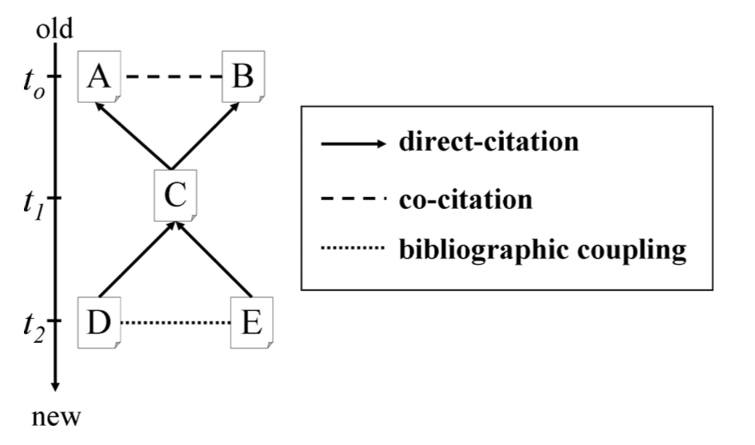
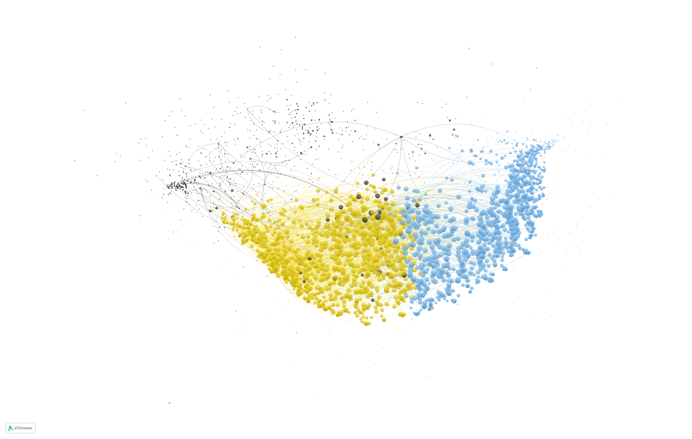

# Green Finance [coupling] {#green-finance-coupling}

Query applied on Scopus:

```

3,663 document results 

TITLE-ABS-KEY ( ( finance  OR  financial )  W/3  ( green  OR  climate  OR  carbon  OR  sustainable ) )  AND  
( LIMIT-TO ( DOCTYPE ,  "ar" )  OR  LIMIT-TO ( DOCTYPE ,  "ch" )  OR  LIMIT-TO ( DOCTYPE ,  "re" )  OR  
LIMIT-TO ( DOCTYPE ,  "bk" ) )  AND  ( LIMIT-TO ( SRCTYPE ,  "j" ) )  
```

Downloaded in September 2021.

```{r eval = F, echo = F, warning = FALSE, error = TRUE, tidy = FALSE, message = FALSE}

M <- convert2df(file = c("bibs/green_finance_1_v2.bib", 
                         "bibs/green_finance_2_v2.bib", 
                         "bibs/green_finance_3_v2.bib"), 
                dbsource = "scopus", format = "bibtex")

export(M, 'rawfiles/M_green_finance_v2.rds')
export(M, 'rawfiles/M_green_finance_v2.csv')
```

[Download csv file.](rawfiles/M_green_finance_v2.csv)

## Growth rate

```{r eval = TRUE, echo = F, warning = FALSE, error = TRUE, tidy = FALSE, message = FALSE}

M <- import('rawfiles/M_green_finance_v2.rds')

M %>>%
    count(PY, sort = F, name = 'Papers') %>>%
    (~ d0) %>>%
    dplyr::filter(PY %in% c(1990:2020)) %>>% 
    dplyr::arrange(PY) %>>% 
    dplyr::mutate(trend = 1:n()) %>>% 
    (. -> d)

d$lnp <- log(d$Papers)

# ajustar parametros via mqo 
m1 <- lm(lnp ~ trend, data = d)
# summary(m1)

beta0 <- m1$coefficients[[1]]
beta1 <- m1$coefficients[[2]]

# modelo não linear
# 2000 é o primeiro ano da série
m2 <- nls(Papers ~ b0 * exp(b1 * (PY - 1990)), start = list(b0 = beta0, b1 = beta1), data = d)
# summary(m2)

# publications estimado
d$predicted <- 1.26206 * exp(0.169719 * (d$PY - 1990))

# taxa de crescimento anual é de 
# (exp(0.20089) - 1) * 100

# o período necessário para dobrar o tempo é 
# log(2) / 0.200827

d %>>% 
    mutate(Year = PY) %>>% 
    mutate(predicted = round(predicted, 0)) %>>% 
    (. -> d)

periodo <- 1990:2024
predicted <- tibble::tibble(PY = periodo, Predicted = round(1.26206 * exp(0.200827 * (periodo - 1990)), 0)) 

dplyr::full_join(d0, predicted) |>
    dplyr::rename(Year = PY) |>
    dplyr::filter(Year >= 1990) ->
    d2

highcharter::hchart(d2, "column", hcaes(x = Year, y = Papers), name = "Publications", showInLegend = TRUE) %>>%
   highcharter::hc_add_series(d2, "line", hcaes(x = Year, y = Predicted), name = "Predicted", showInLegend = TRUE) %>>% 
   highcharter::hc_add_theme(hc_theme_google()) %>>%
   highcharter::hc_navigator(enabled = TRUE)  %>>% 
   highcharter::hc_exporting(enabled = TRUE, filename = 'groups_growth') %>>%
   highcharter::hc_xAxis(plotBands = list(list(from = 2020, to = 2020, color = "#330000")))
```

Analysis 1990-2020
<ul>
  <li> Growth Rate 22% </li>
  <li> Doubling time  3.4 Years </li>
</ul>


## Growth rate - Scopus

```{r eval = TRUE, echo = F, warning = FALSE, error = TRUE, tidy = FALSE, message = FALSE}

d0 <- read.table('rawfiles/Scopus-38425968-Analyze-Year.csv', header = T, sep = ',', skip = 3) 

d0 |>
    dplyr::mutate(Papers = Papers / 100000) |> 
    dplyr::filter(PY %in% c(1990:2020)) %>>% 
    dplyr::arrange(PY) %>>% 
    dplyr::mutate(trend = 1:n()) %>>% 
    (. -> d)

d$lnp <- log(d$Papers)

# ajustar parametros via mqo 
m1 <- lm(lnp ~ trend, data = d)
# summary(m1)

beta0 <- m1$coefficients[[1]]
beta1 <- m1$coefficients[[2]]

# modelo não linear
# 2000 é o primeiro ano da série
m2 <- nls(Papers ~ b0 * exp(b1 * (PY - 1990)), start = list(b0 = beta0, b1 = beta1), data = d)
# summary(m2)

# publications estimado
d$predicted <- 1.26206 * exp(0.169719 * (d$PY - 1990))

# taxa de crescimento anual é de 
# (exp(0.0533495) - 1) * 100

# o período necessário para dobrar o tempo é 
# log(2) / 0.0533495
```

Analysis 1990-2020
<ul>
  <li> Growth Rate 5.5% </li>
  <li> Doubling time  13 Years </li>
</ul>

<!--

## Top 10 authors

```{r eval=TRUE, echo=F, warning=FALSE, error=TRUE, tidy=FALSE, message=FALSE}

M |> 
    dplyr::filter(AU != 'NA NA') ->
    M2

topAU <- authorProdOverTime(M2, k = 15, graph = TRUE)
```

-->

## Network

Bibliographic coupling was chosen, because it focuses on the most recent papers.

```{r echo=F, fig.cap="Bibliographic Coupling [Shibata et al (2009)]", out.width = '68%'}

```

```{r eval=TRUE, echo= F, warning=FALSE, error=TRUE, tidy=FALSE, message=FALSE}

M |> 
    bibliometrix::biblioNetwork(analysis = "coupling", network = "references", sep = ";") |> 
    igraph::graph_from_adjacency_matrix(mode = "undirected", weighted = NULL, diag = FALSE) |> 
    igraph::simplify() |>
    tidygraph::as_tbl_graph() -> 
    net

net |>
    tidygraph::activate(nodes) |>
    dplyr::left_join(M |> dplyr::mutate(name = paste(SR, PY, sep = '. ')) |> dplyr::select(name, PY, AB, DE, TI, DI, SO, TC, AU, SR)) ->
    net
```

## Componets 

Giant component of our network holds 3275 papers.

```{r eval=TRUE, echo = F, warning=FALSE, error=TRUE, tidy=FALSE, message=FALSE, rows.print=5}

comp <- birddog::sniff_components(net)

net2 <- comp$network

comp$components |>
    dplyr::slice(1:20) |>
    rmarkdown::paged_table()
```

## Groups

```{r eval=TRUE, echo=F, warning=FALSE, error=TRUE, tidy=FALSE, message=FALSE}

gru <- birddog::sniff_groups(net2, 
                             min_group_size = 15, 
                             keep_component = 'component01', 
                             cluster_component = 'component01', 
                             algorithm = 'louvain')

net3 <- gru$network

gru$aggregate %>>% 
    as_tibble() %>>%
    dplyr::mutate(group = gsub('^.*_', '', group)) %>>% 
    rmarkdown::paged_table()
```

## Network plot

```{r eval=F, echo=F, warning=FALSE, error=TRUE, tidy=FALSE, message=FALSE}

net3 |>
    activate(nodes) |>
    dplyr::select(name, group) |>
    dplyr::mutate(group = gsub('^.*_', '', group)) |>
    dplyr::filter(group %in% c('g01', 'g02', 'g03')) |>
    dplyr::mutate(group_color = ifelse(group == 'g01', 1, ifelse(group == 'g02', 2, 3))) ->
    net4

V(net4)$id <- 1:length(V(net4))

write_graph(net4, file = 'networks/net4.net', format = c("pajek")) 
writePajek(V(net4)$group_color, 'networks/net4.clu')
```

- LogLin default
- Scale 0
- Labels 0
<!-- - Alterei as cores dos vértices -->

[Network file.](networks/net4_2.png)



## Groups growth 

```{r eval=TRUE, echo=F, warning=FALSE, error=TRUE, tidy=FALSE, message=FALSE}

# M + groups 
tidygraph::as_tbl_graph(gru$network) |>
    tidygraph::activate(nodes) |>
    tibble::as_tibble() |>
    dplyr::left_join(M |> select(SR, CR)) ->
    m_groups

m_groups |>
    dplyr::group_by(group, PY) |>
    dplyr::tally(name = 'Publications') |>
    dplyr::ungroup() |>
    dplyr::mutate(group = gsub('^.*_', '', group)) |>
    dplyr::rename(Group = group, Year = PY) |>
    dplyr::filter(Year < 2021) |>
    dplyr::filter(!is.na(Group)) ->
    groups_growth

highcharter::hchart(groups_growth, "line", hcaes(x = Year, y = Publications, group = Group), fillOpacity = 0.2) %>>% 
    highcharter::hc_add_theme(hc_theme_elementary())  %>>% 
    highcharter::hc_navigator(enabled = TRUE)  %>>% 
    highcharter::hc_exporting(enabled = TRUE, filename = 'groups_growth')
```

## Groups growth rate 

```{r eval=T, echo=F, warning=FALSE, error=TRUE, tidy=FALSE, message=FALSE}

grupos <- sort(unique(groups_growth$Group))

res <- vector('double', length(grupos))

for (i in seq_along(grupos)) { 

    groups_growth |> 
        dplyr::filter(Group==paste0('g0', i)) |> 
        dplyr::arrange(Year) |>  
        dplyr::filter(Year >= 2010) |>
        dplyr::mutate(trend = 1:n()) |>
        dplyr::mutate(lnp = log(Publications)) ->
        d 

    # ajustar parametros via mqo 
    m1 <- lm(lnp ~ trend, data = d)
    beta0 <- m1$coefficients[[1]]
    beta1 <- m1$coefficients[[2]]
    
    # modelo não linear
    m2 <- nls(Publications ~ b0*exp(b1 * (Year - 2010)), start = list(b0 = beta0, b1 = beta1), data = d)
    res[[i]] <- coef(m2)[2]

}

data.frame(Group = grupos, Coef = res) %>>% 
    tibble::as_tibble() %>>% 
    dplyr::mutate(GrowthRateYear = (exp(Coef) - 1)*100) %>>% 
    dplyr::select(-Coef) %>>% 
    left_join(gru$aggregate |> dplyr::mutate(group = gsub('^.*_', '', group)) |> dplyr::rename(Group = group)) %>>% 
    dplyr::select(Group, quantity_papers, average_age, GrowthRateYear) |> 
    rmarkdown::paged_table()
```

<!--

## Groups description

### Keywords tfidf

-->

```{r eval=F, echo=F, warning=FALSE, error=TRUE, tidy=FALSE, message=FALSE}

# M + groups 
tidygraph::as_tbl_graph(gru$network) |>
    tidygraph::activate(nodes) |>
    tibble::as_tibble() |>
    dplyr::left_join(M |> select(SR, CR)) ->
    m_groups

# keywords: frequency and tfidf per group
m_groups |> 
    dplyr::select(.data$group, .data$DE) |> 
    dplyr::filter(!is.na(.data$group)) |> 
    dplyr::filter(!is.na(.data$DE)) -> 
    groups_keywords

keywords_freq_tfidf <- birddog::sniff_tfidf(groups_keywords, 
                                            group, 
                                            DE,
                                            separate_rows = T, 
                                            sep = ';', 
                                            n_terms = 15)

keywords_freq_tfidf |>
    dplyr::mutate(group = gsub('^.*_', '', group)) |>
    dplyr::rename(keyword_freq = term_freq, keyword_tfidf = term_tfidf) |>
        DT::datatable(extensions = 'Buttons', rownames = F, 
                      options = list(
                                     dom = 'Bfrtip', pageLength = 10, 
                                     buttons = list(list( extend = 'collection', 
                                                         buttons = list( list(extend = 'csv', filename = 'data'), 
                                                        list(extend = 'excel', filename = 'data')), 
                                                        text = 'Download'))))
```

<!--

### Terms NLP

Terms generated by Natural Language Processing using noun phrase filters.

-->

```{r eval=F, echo=F, warning=FALSE, error=TRUE, tidy=FALSE, message=FALSE}

# terms via NLP
m_groups |>
    dplyr::filter(!is.na(.data$group)) |> 
    dplyr::group_by(.data$group) |>
    dplyr::summarise(text = paste(.data$TI, .data$AB, collapse = '. ')) |>
    dplyr::mutate(text = tolower(.data$text)) |>
    dplyr::mutate(text = gsub('elsevier|elsevier b v', '', text)) ->
    groups_texts

# time consuming
tictoc::tic()
groups_texts |>
    {\(x) split(x, x$group)}() |>
    purrr::map(~ birddog::sniff_terms(data = ., 
                                      groups = group, 
                                      text = text, 
                                      algorithm = 'phrase', 
                                      n_cores = 3)) |>
    purrr::map(~ tibble::as_tibble(.)) ->
    group_term_occorrence_phrase
tictoc::toc()
## 20 minutes
#
# rio::export(group_term_occorrence_phrase, 'rawfiles/green_finance_group_term_occorrence_phrase_v2.rds')

import('rawfiles/green_finance_group_term_occorrence_phrase_v2.rds') -> 
    group_term_occorrence_phrase 

# tfidf and frequency for NLP terms 
dplyr::bind_rows(group_term_occorrence_phrase, .id = 'group') |>
    dplyr::filter(.data$ngram > 1 & .data$freq > 2) |>
    dplyr::select(group, keyword, freq) |>
    {\(x) birddog::sniff_tfidf(x, group = group, term = keyword, frequency = freq)}() ->
    terms_freq_tfidf

terms_freq_tfidf |>
    dplyr::mutate(group = gsub('^.*_', '', group)) |>
        DT::datatable(extensions = 'Buttons', rownames = F, 
                      options = list(
                                     dom = 'Bfrtip', pageLength = 10, 
                                     buttons = list(list( extend = 'collection', 
                                                         buttons = list( list(extend = 'csv', filename = 'data'), 
                                                        list(extend = 'excel', filename = 'data')), 
                                                        text = 'Download'))))
```


## Authors per group

```{r eval=T, echo=F, warning=FALSE, error=TRUE, tidy=FALSE, message=FALSE}

qtde_authors <- 10

m_groups %>>%
    dplyr::filter(!is.na(group)) %>>% 
    dplyr::select(group, AU) %>>%
    tidyr::separate_rows(AU, sep = ';') %>>%
    dplyr::group_by(group, AU) %>>% 
    dplyr::tally(sort = T) %>>% 
    dplyr::ungroup() %>>% 
    dplyr::arrange(group, desc(n)) %>>% 
    dplyr::mutate(AU = stri_trim(AU)) %>>% 
    (. -> grupoAUfreq)

grupoAUfreq %>>% 
    dplyr::group_by(group) %>>% 
    dplyr::arrange(group, desc(n)) %>>% 
    dplyr::top_n(qtde_authors) %>>% 
    dplyr::filter(n >= 1) %>>% 
    dplyr::mutate(authors_freq = paste0(AU, ' (', n, ')')) %>>% 
    dplyr::select(-n) %>>% 
    dplyr::ungroup() %>>%
    (. -> authors_freq)

authors_freq |>
    dplyr::group_by(group) |>
    dplyr::summarise(authors_freq = paste(authors_freq, collapse = ', ')) |> 
    dplyr::mutate(group = gsub('^.*_', '', group)) |>
    DT::datatable(extensions = 'Buttons', rownames = F, 
                  options = list(dom = 'Bfrtip', pageLength = 6, 
                                 buttons = list(list(extend = 'collection', 
                                                     buttons = list(list(extend = 'csv', filename = 'data'), 
                                                                    list(extend = 'excel', filename = 'data')), 
                                                 text = 'Download'))))
```

## Journals per group

```{r eval=T, echo=F, warning=FALSE, error=TRUE, tidy=FALSE, message=FALSE}

qtde_journals <- 10

m_groups |>
    dplyr::filter(!is.na(group)) |> 
    dplyr::select(group, SO) |>
    dplyr::group_by(group, SO) |> 
    dplyr::tally(sort = TRUE) |>
    dplyr::arrange(group, desc(n)) |> 
    dplyr::top_n(qtde_journals) |> 
    dplyr::filter(n > 1) |> 
    dplyr::mutate(n = paste0('(', n, ')')) |> 
    dplyr::mutate(SO2 = paste(SO, n, sep =' ')) |>
    dplyr::group_by(group) |>
    dplyr::summarise(SourceTitle = paste(SO2, collapse = '; ')) |>
    dplyr::mutate(group = gsub('^.*_', '', group)) |>
        DT::datatable(extensions = 'Buttons', rownames = F, 
                      options = list(
                                     dom = 'Bfrtip', pageLength = 10, 
                                     buttons = list(list( extend = 'collection', 
                                                         buttons = list( list(extend = 'csv', filename = 'data'), 
                                                        list(extend = 'excel', filename = 'data')), 
                                                        text = 'Download'))))
```


## Hubs per group

```{r eval=T, echo=F, warning=FALSE, error=TRUE, tidy=FALSE, message=FALSE}

m_groups |>
    dplyr::select(SR, group, CR, TC, PY, TI) |> 
    dplyr::filter(!is.na(group)) -> 
    tt

# birddog::sniff_topological_positions(m_groups, 
#                                      id = SR, 
#                                      group = group, 
#                                      PY = PY, 
#                                      TI = TI, 
#                                      CR = CR, 
#                                      min.citations = 1) ->
#     hubs
#
# rio::export(hubs, 'rawfiles/hubs_green_finance_v2.rds')

rio::import('rawfiles/hubs_green_finance_v2.rds') -> 
    hubs

# hubs full info
hubs |>    
    dplyr::mutate(group = gsub('^.*_', '', group)) |>
    dplyr::distinct(SR, .keep_all = TRUE) |>
    dplyr::left_join(m_groups %>>% select(SR, AU, PY, TI, DE, DI, AB)) |>    
    dplyr::relocate(group, SR, PY) |>
    dplyr::distinct(SR, .keep_all = T) ->
    hubs_full_info

rio::export(hubs_full_info, 'rawfiles/hubs_full_info_green_finance_v2.xlsx')

# Hubs per group
hubs |> 
    dplyr::mutate(group = gsub('^.*_', '', group)) |>
    dplyr::distinct(SR, .keep_all = TRUE) |>
    dplyr::mutate(hub = ifelse(Zi >= 2.5, 'hub', 'nohub')) |> 
    dplyr::count(group, hub) |> 
    tidyr::spread(hub, n) |>
    dplyr::mutate(group = gsub('^.*_', '', group)) |>
    rmarkdown::paged_table()

hubs |>
    dplyr::mutate(group = gsub('^.*_', '', group)) |>
    dplyr::distinct(SR, .keep_all = TRUE) |>
    dplyr::filter(zone != 'noHub') |>
    dplyr::mutate(group = gsub('^.*_', '', group)) |>
    dplyr::mutate(Zi = round(Zi, digits = 2), Pi = round(Pi, digits = 2)) |>
        DT::datatable(extensions = 'Buttons', rownames = F, 
                      options = list(
                                     dom = 'Bfrtip', pageLength = 10, 
                                     buttons = list(list(extend = 'collection', 
                                                         buttons = list(list(extend = 'csv', filename = 'data'), 
                                                        list(extend = 'excel', filename = 'data')), 
                                                        text = 'Download'))))
```

- TC = Scopus times cited
- Ki = Network citations
- ki = Group citations
- Zi = The within-group degree $z_i$ measures how ‘well-connected’ article $i$ is to other articles in the group [$z_i \geq 2.5$ Hub]
- Pi = Measures how ‘well-distributed’ the links of article $i$ are among different groups. [higher $=$ citations better distributed between groups]
- zone = $R5$ provincial hubs; $R6$ connector hubs; $R7$ kinless hubs 
- TI = Title
- DI = DOI
- AB = Abstract
- DE = Keywords

[Excel file with papers' full info.](rawfiles/hubs_full_info_green_finance_v2.xlsx)

<!--

## Groups immersion

### g01  

Autores com 2 ou mais parcerias.

```{r eval=T, echo=F, fig.height = 7, fig.width = 12, warning=FALSE, error=TRUE, tidy=FALSE, message=FALSE}

aut <- get_authors_network(M, 
                           m_groups, 
                           hubs_full_info, 
                           keep_group = 'component01_g01', 
                           internal_citations = 2)

visNetwork(aut$nodes, 
           aut$edges, 
           main = "Authors collaboration - g01",
           height = "700px", 
           width = '800px') %>>% 
    visIgraphLayout(layout = "layout_with_kk")  |>
    visOptions(highlightNearest = TRUE, nodesIdSelection = TRUE) |>
    visInteraction(navigationButtons = TRUE)
```

### g02

Autores com 3 ou mais parcerias.

```{r eval=T, echo=F, fig.height = 7, fig.width = 12, warning=FALSE, error=TRUE, tidy=FALSE, message=FALSE}

aut <- get_authors_network(M, 
                           m_groups, 
                           hubs_full_info, 
                           keep_group = 'component01_g02', 
                           internal_citations = 3)

visNetwork(aut$nodes, 
           aut$edges, 
           main = "Authors collaboration - g02",
           height = "700px", 
           width = '800px') %>>% 
    visIgraphLayout(layout = "layout_with_kk")  |>
    visOptions(highlightNearest = TRUE, nodesIdSelection = TRUE) |>
    visInteraction(navigationButtons = TRUE)
```

### g03


```{r eval=T, echo=F, fig.height = 7, fig.width = 12, warning=FALSE, error=TRUE, tidy=FALSE, message=FALSE}

aut <- get_authors_network(M, 
                           m_groups, 
                           hubs_full_info, 
                           keep_group = 'component01_g03', 
                           internal_citations = 2)

visNetwork(aut$nodes, 
           aut$edges, 
           main = "Authors collaboration - g03",
           height = "700px", 
           width = '800px') %>>% 
    visIgraphLayout(layout = "layout_with_kk")  |>
    visOptions(highlightNearest = TRUE, nodesIdSelection = TRUE) |>
    visInteraction(navigationButtons = TRUE)
```

-->

## Topic Modeling  

Wikipedia description:

* _In machine learning and natural language processing, a topic model is a type of statistical model for discovering the abstract "topics" that occur in a collection of documents. Topic modeling is a frequently used text-mining tool for discovery of hidden semantic structures in a text body._

Tutorials:

* [A Friendly Introduction to Text Clustering](https://medium.com/swlh/topic-modeling-in-r-with-tidytext-and-textminer-package-latent-dirichlet-allocation-764f4483be73)
* [YT Short Introduction to Topic Modeling](https://www.youtube.com/watch?v=p1I9Sa1lRvk)
* [YT Introduction to Topic Modeling with R](https://www.youtube.com/watch?v=IUAHUEy1V0Q)
* [YT David Blei Palestra](https://www.youtube.com/watch?v=FkckgwMHP2s&t=490s)


* STM - Structural Topic Modeling [@roberts2016]
    * allow to use document metadata to improve classification

* STM is a new version of famous LDA [@blei2012]

* Define the number of topics [@kim2020]:

* __semantic coherence__ reflects the fact that high-probability terms of a topic tend to occur together across documents under analysis [@roberts2016]. 
* __exclusivity__ of topic terms dictates that high-probability terms in one topic should not overlap with high-probability terms in other topics, and that high-probability terms be unique and exclusive to one topic only [@bischof2012].

* Other works on topic modeling: @kuhn2018, @chen2020, @chen2020b, @hsu2019, @lee2020, @qian2021, @ranaei2019, @tontodimamma2020.

@kuhn2018 also chose the number of topics using the same type of graph generated here.

### g01

```{r eval = T, echo = F, warning = FALSE, error = TRUE, tidy = FALSE, message = FALSE}

m_groups |>
    dplyr::filter(group == 'component01_g01') |>
    dplyr::mutate(texto = paste(TI, AB, DE, sep = ' .')) ->
    stm_g01

# * default parameters
stm::textProcessor(documents = stm_g01$texto,             
                   metadata = stm_g01[, c('SR', 'TI', 'TC', 'PY')],        
                   lowercase = TRUE,                  
                   removestopwords = TRUE,            
                   removenumbers = TRUE,             
                   removepunctuation = TRUE,          
                   stem = TRUE,                       
                   wordLengths = c(3, Inf),           
                   sparselevel = 1,                   
                   language = "en",                   
                   verbose = TRUE,                    
                   onlycharacter = TRUE,              
                   striphtml = FALSE,                 
                   customstopwords = NULL,            
                   v1 = FALSE) ->
    stm_g01_prep

# class(stm_g01_prep)
# names(stm_g01_prep)

stm::prepDocuments(stm_g01_prep$documents, 
                   stm_g01_prep$vocab, 
                   stm_g01_prep$meta, 
                   lower.thresh = 5) ->
    stm_g01_doc

# names(stm_g01_doc)

# ------------------------------
## search K topics

# tictoc::tic()
# stm::searchK(documents = stm_g01_doc$documents, 
#         vocab = stm_g01_doc$vocab,
#         K = c(2, 5, 10:20, 25, 30, 40),          
#         N = 100,                                   
#         proportion = 0.5,                          
#         heldout.seed = 1234,                       
#         M = 10,                                    
#         cores = 1,                                 
#         # prevalence = ~ PY,
#         max.em.its = 75,
#         data = stm_g01_doc$meta,
#         init.type = "Spectral",
#         verbose = F) ->
#     m_searchK 
# tictoc::toc()
#
# plot(m_searchK)
# m_searchK$results
#
# rio::export(m_searchK, 'rawfiles/m_searchK_g01.rds')
rio::import('rawfiles/m_searchK_g01.rds') -> m_searchK

data.frame(K = unlist(m_searchK$results$K),
           semcoh = unlist(m_searchK$results$semcoh),
           exclus = unlist(m_searchK$results$exclus)) ->
    res

res$cor <- ifelse(res$K == 10, 'selecionado', 'nao')

ggplot2::ggplot(res, aes(x = semcoh, y = exclus)) +
    ggplot2::geom_point(shape = 21, size = 3, position = "identity") +
    ggplot2::geom_line() +
    ggrepel::geom_text_repel(data = res, aes(label = K), size = 6) +
    ggplot2::geom_vline(xintercept = res[res$cor == 'selecionado', 'semcoh'], linetype = 'dashed') +
    ggplot2::labs(x = 'Semantic Coherence', y = 'Exclusivity', title = 'g01') +
    ggplot2::theme_classic() +
    ggplot2::theme(legend.position = "none") 
```


```{r eval = T, echo = F, warning = FALSE, error = TRUE, tidy = FALSE, message = FALSE}
# ------------------------------
## Modeling 

stm::stm(documents = stm_g01_doc$documents, 
    vocab = stm_g01_doc$vocab, 
    K = 10, 
    data = stm_g01_doc$meta,
    init.type = "Spectral",
    verbose = F) ->
    stm_g01_stm

# stm::labelTopics(stm_g01_stm)
# plot(stm_g01_stm, n = 15)
# stm::findThoughts(stm_g01_stm, texts = stm_g01_doc$meta$title_dwpi, topics = c(12, 13, 7), n = 2)
# stm::cloud(stm_g01_stm, topic = 3, scale = c(6, .25))

# stm::findThoughts(stm_g01_stm, texts = stm_g01_doc$meta$SR, topics = c(12), n = 10) |>
#     {\(acima) stm_g01_doc$meta[acima$index[[1]], ] |> tibble::as_tibble() }() |>
#     dplyr::pull(title_dwpi)


# ------------------------------
## Explore the topic model

# gamma: probabilidade de cada termo pertencer a cada tópico
# theta: probabilidade de cada documento pertencer a cada tópico

tidytext::tidy(stm_g01_stm) |>
    dplyr::arrange(beta) |>
    dplyr::group_by(topic) |>
    dplyr::top_n(10, beta) |>
    dplyr::arrange(-beta) |>
    dplyr::select(topic, term) |>
    dplyr::summarise(terms = list(term)) |>
    dplyr::mutate(terms = purrr::map(terms, paste, collapse = ", ")) |> 
    tidyr::unnest() ->
    top_terms 

tidytext::tidy(stm_g01_stm, matrix = "gamma", document_names = stm_g01_prep$meta$publication_number) |>
    group_by(topic) |>
    summarise(gamma = mean(gamma)) |>
    arrange(desc(gamma)) |>
    left_join(top_terms, by = "topic") |>
    mutate(topic = paste0("Topic ", topic), topic = reorder(topic, gamma)) ->
    gamma_terms  

gamma_terms |>
    dplyr::mutate(topic = tolower(.data$topic)) |>
    dplyr::mutate(topic = gsub(' ', '_', .data$topic)) |>
    dplyr::mutate(gamma = round(.data$gamma, digits = 3)) |> 
    DT::datatable(
        extensions = 'Buttons', 
        rownames = F, 
        options = list(
                    dom = 'Bfrtip', 
                    pageLength = 12, 
                    buttons = list(list(
                                        extend = 'collection', 
                                        buttons = list(list(extend = 'csv', filename = 'data'), 
                                                        list(extend = 'excel', filename = 'data')), 
                                                        text = 'Download'))))
```

```{r eval = T, echo = F, warning = FALSE, error = TRUE, tidy = FALSE, message = FALSE}

tidytext::tidy(stm_g01_stm, matrix = "theta", document_names = stm_g01_prep$meta$SR) |> 
    dplyr::left_join(stm_g01 |> dplyr::select(document = SR, PY, TI, AB)) |>
    dplyr::distinct(.keep_all = TRUE) |> 
    dplyr::arrange(document, topic) -> 
    gamma_documents

rio::import('rawfiles/hubs_green_finance_v2.rds') |> 
    tibble::as_tibble() |>
    dplyr::select(document = SR, zone) |>
    dplyr::right_join(gamma_documents) |>
    dplyr::relocate(zone, .after = PY) |>
    dplyr::mutate(topic = paste0('topic_', topic)) |> 
    dplyr::mutate(gamma = round(.data$gamma, digits = 3)) |> 
    dplyr::rename(year = PY) -> 
    gamma_documents

rio::export(gamma_documents, 'rawfiles/stm_g01_documents_hubs.xlsx')

gamma_documents |>
    dplyr::group_by(topic) |>
    dplyr::arrange(dplyr::desc(gamma)) |>
    dplyr::slice_head(n = 200) |>
    dplyr::ungroup() ->
    gamma_documents

gamma_documents |>
    DT::datatable(
        rownames = FALSE,
        filter = 'bottom',
        extensions = 'Buttons', 
        options = list(
                    dom = 'Blfrtip', pageLength = 5,
                        columnDefs = list(list(visible = FALSE, targets = c(6))), 
                        buttons = list(list(extend = 'colvis', columns = c(0, 1, 2, 4, 5, 6)))
                        ))

```

[Excel file with topic and hubs full info.](rawfiles/stm_g01_documents_hubs.xlsx)

### g02

```{r eval = T, echo = F, warning = FALSE, error = TRUE, tidy = FALSE, message = FALSE}

m_groups |>
    dplyr::filter(group == 'component01_g02') |>
    dplyr::mutate(texto = paste(TI, AB, DE, sep = ' .')) ->
    stm_g02

# * default parameters
stm::textProcessor(documents = stm_g02$texto,             
                   metadata = stm_g02[, c('SR', 'TI', 'TC', 'PY')],        
                   lowercase = TRUE,                  
                   removestopwords = TRUE,            
                   removenumbers = TRUE,             
                   removepunctuation = TRUE,          
                   stem = TRUE,                       
                   wordLengths = c(3, Inf),           
                   sparselevel = 1,                   
                   language = "en",                   
                   verbose = TRUE,                    
                   onlycharacter = TRUE,              
                   striphtml = FALSE,                 
                   customstopwords = NULL,            
                   v1 = FALSE) ->
    stm_g02_prep

# class(stm_g02_prep)
# names(stm_g02_prep)

stm::prepDocuments(stm_g02_prep$documents, 
                   stm_g02_prep$vocab, 
                   stm_g02_prep$meta, 
                   lower.thresh = 5) ->
    stm_g02_doc

# names(stm_g02_doc)

# ------------------------------
## search K topics

# tictoc::tic()
# stm::searchK(documents = stm_g02_doc$documents, 
#         vocab = stm_g02_doc$vocab,
#         K = c(2, 5, 10:15, 20, 25, 30, 40),          
#         N = 100,                                   
#         proportion = 0.5,                          
#         heldout.seed = 1234,                       
#         M = 10,                                    
#         cores = 1,                                 
#         # prevalence = ~ PY,
#         max.em.its = 75,
#         data = stm_g02_doc$meta,
#         init.type = "Spectral",
#         verbose = F) ->
#     m_searchK 
# tictoc::toc()
#
# plot(m_searchK)
# m_searchK$results
#
# rio::export(m_searchK, 'rawfiles/m_searchK_g02.rds')
rio::import('rawfiles/m_searchK_g02.rds') -> m_searchK

data.frame(K = unlist(m_searchK$results$K),
           semcoh = unlist(m_searchK$results$semcoh),
           exclus = unlist(m_searchK$results$exclus)) ->
    res

res$cor <- ifelse(res$K == 10, 'selecionado', 'nao')

ggplot2::ggplot(res, aes(x = semcoh, y = exclus)) +
    ggplot2::geom_point(shape = 21, size = 3, position = "identity") +
    ggplot2::geom_line() +
    ggrepel::geom_text_repel(data = res, aes(label = K), size = 6) +
    ggplot2::geom_vline(xintercept = res[res$cor == 'selecionado', 'semcoh'], linetype = 'dashed') +
    ggplot2::labs(x = 'Semantic Coherence', y = 'Exclusivity', title = 'g02') +
    ggplot2::theme_classic() +
    ggplot2::theme(legend.position = "none") 
```


```{r eval = T, echo = F, warning = FALSE, error = TRUE, tidy = FALSE, message = FALSE}
# ------------------------------
## Modeling 

stm::stm(documents = stm_g02_doc$documents, 
    vocab = stm_g02_doc$vocab, 
    K = 10, 
    data = stm_g02_doc$meta,
    init.type = "Spectral",
    verbose = F) ->
    stm_g02_stm

# stm::labelTopics(stm_g02_stm)
# plot(stm_g02_stm, n = 15)
# stm::findThoughts(stm_g02_stm, texts = stm_g02_doc$meta$title_dwpi, topics = c(12, 13, 7), n = 2)
# stm::cloud(stm_g02_stm, topic = 3, scale = c(6, .25))

# stm::findThoughts(stm_g02_stm, texts = stm_g02_doc$meta$SR, topics = c(12), n = 10) |>
#     {\(acima) stm_g02_doc$meta[acima$index[[1]], ] |> tibble::as_tibble() }() |>
#     dplyr::pull(title_dwpi)


# ------------------------------
## Explore the topic model

# gamma: probabilidade de cada termo pertencer a cada tópico
# theta: probabilidade de cada documento pertencer a cada tópico

tidytext::tidy(stm_g02_stm) |>
    dplyr::arrange(beta) |>
    dplyr::group_by(topic) |>
    dplyr::top_n(10, beta) |>
    dplyr::arrange(-beta) |>
    dplyr::select(topic, term) |>
    dplyr::summarise(terms = list(term)) |>
    dplyr::mutate(terms = purrr::map(terms, paste, collapse = ", ")) |> 
    tidyr::unnest() ->
    top_terms 

tidytext::tidy(stm_g02_stm, matrix = "gamma", document_names = stm_g02_prep$meta$publication_number) |>
    group_by(topic) |>
    summarise(gamma = mean(gamma)) |>
    arrange(desc(gamma)) |>
    left_join(top_terms, by = "topic") |>
    mutate(topic = paste0("Topic ", topic), topic = reorder(topic, gamma)) ->
    gamma_terms  

gamma_terms |>
    dplyr::mutate(topic = tolower(.data$topic)) |>
    dplyr::mutate(topic = gsub(' ', '_', .data$topic)) |>
    dplyr::mutate(gamma = round(.data$gamma, digits = 3)) |> 
    DT::datatable(
        extensions = 'Buttons', 
        rownames = F, 
        options = list(
                    dom = 'Bfrtip', 
                    pageLength = 12, 
                    buttons = list(list(
                                        extend = 'collection', 
                                        buttons = list(list(extend = 'csv', filename = 'data'), 
                                                        list(extend = 'excel', filename = 'data')), 
                                                        text = 'Download'))))
```

```{r eval = T, echo = F, warning = FALSE, error = TRUE, tidy = FALSE, message = FALSE}

tidytext::tidy(stm_g02_stm, matrix = "theta", document_names = stm_g02_prep$meta$SR) |> 
    dplyr::left_join(stm_g02 |> dplyr::select(document = SR, PY, TI, AB)) |>
    dplyr::distinct(.keep_all = TRUE) |> 
    dplyr::arrange(document, topic) -> 
    gamma_documents

rio::import('rawfiles/hubs_green_finance_v2.rds') |> 
    tibble::as_tibble() |>
    dplyr::select(document = SR, zone) |>
    dplyr::right_join(gamma_documents) |>
    dplyr::relocate(zone, .after = PY) |>
    dplyr::mutate(topic = paste0('topic_', topic)) |> 
    dplyr::mutate(gamma = round(.data$gamma, digits = 3)) |> 
    dplyr::rename(year = PY) -> 
    gamma_documents

rio::export(gamma_documents, 'rawfiles/stm_g02_documents_hubs.xlsx')

gamma_documents |>
    dplyr::group_by(topic) |>
    dplyr::arrange(dplyr::desc(gamma)) |>
    dplyr::slice_head(n = 200) |>
    dplyr::ungroup() ->
    gamma_documents

gamma_documents |>
    DT::datatable(
        rownames = FALSE,
        filter = 'bottom',
        extensions = 'Buttons', 
        options = list(
                    dom = 'Blfrtip', pageLength = 5,
                        columnDefs = list(list(visible = FALSE, targets = c(6))), 
                        buttons = list(list(extend = 'colvis', columns = c(0, 1, 2, 4, 5, 6)))
                        ))

```

[Excel file with topic and hubs full info.](rawfiles/stm_g02_documents_hubs.xlsx)


### g03

```{r eval = T, echo = F, warning = FALSE, error = TRUE, tidy = FALSE, message = FALSE}

m_groups |>
    dplyr::filter(group == 'component01_g03') |>
    dplyr::mutate(texto = paste(TI, AB, DE, sep = ' .')) ->
    stm_g03

# * default parameters
stm::textProcessor(documents = stm_g03$texto,             
                   metadata = stm_g03[, c('SR', 'TI', 'TC', 'PY')],        
                   lowercase = TRUE,                  
                   removestopwords = TRUE,            
                   removenumbers = TRUE,             
                   removepunctuation = TRUE,          
                   stem = TRUE,                       
                   wordLengths = c(3, Inf),           
                   sparselevel = 1,                   
                   language = "en",                   
                   verbose = TRUE,                    
                   onlycharacter = TRUE,              
                   striphtml = FALSE,                 
                   customstopwords = NULL,            
                   v1 = FALSE) ->
    stm_g03_prep

# class(stm_g03_prep)
# names(stm_g03_prep)

stm::prepDocuments(stm_g03_prep$documents, 
                   stm_g03_prep$vocab, 
                   stm_g03_prep$meta, 
                   lower.thresh = 5) ->
    stm_g03_doc

# names(stm_g03_doc)

# ------------------------------
## search K topics

# tictoc::tic()
# stm::searchK(documents = stm_g03_doc$documents, 
#         vocab = stm_g03_doc$vocab,
#         K = c(2, 5, 10:15, 20, 25, 30, 40),          
#         N = 100,                                   
#         proportion = 0.5,                          
#         heldout.seed = 1234,                       
#         M = 10,                                    
#         cores = 1,                                 
#         # prevalence = ~ PY,
#         max.em.its = 75,
#         data = stm_g03_doc$meta,
#         init.type = "Spectral",
#         verbose = F) ->
#     m_searchK 
# tictoc::toc()
#
# plot(m_searchK)
# m_searchK$results
#
# rio::export(m_searchK, 'rawfiles/m_searchK_g03.rds')
rio::import('rawfiles/m_searchK_g03.rds') -> m_searchK

data.frame(K = unlist(m_searchK$results$K),
           semcoh = unlist(m_searchK$results$semcoh),
           exclus = unlist(m_searchK$results$exclus)) ->
    res

res$cor <- ifelse(res$K == 10, 'selecionado', 'nao')

ggplot2::ggplot(res, aes(x = semcoh, y = exclus)) +
    ggplot2::geom_point(shape = 21, size = 3, position = "identity") +
    ggplot2::geom_line() +
    ggrepel::geom_text_repel(data = res, aes(label = K), size = 6) +
    ggplot2::geom_vline(xintercept = res[res$cor == 'selecionado', 'semcoh'], linetype = 'dashed') +
    ggplot2::labs(x = 'Semantic Coherence', y = 'Exclusivity', title = 'g03') +
    ggplot2::theme_classic() +
    ggplot2::theme(legend.position = "none") 
```

```{r eval = T, echo = F, warning = FALSE, error = TRUE, tidy = FALSE, message = FALSE}

# ------------------------------
## Modeling 

stm::stm(documents = stm_g03_doc$documents, 
    vocab = stm_g03_doc$vocab, 
    K = 10, 
    data = stm_g03_doc$meta,
    init.type = "Spectral",
    verbose = F) ->
    stm_g03_stm

# stm::labelTopics(stm_g03_stm)
# plot(stm_g03_stm, n = 15)
# stm::findThoughts(stm_g03_stm, texts = stm_g03_doc$meta$title_dwpi, topics = c(12, 13, 7), n = 2)
# stm::cloud(stm_g03_stm, topic = 3, scale = c(6, .25))

# stm::findThoughts(stm_g03_stm, texts = stm_g03_doc$meta$SR, topics = c(12), n = 10) |>
#     {\(acima) stm_g03_doc$meta[acima$index[[1]], ] |> tibble::as_tibble() }() |>
#     dplyr::pull(title_dwpi)


# ------------------------------
## Explore the topic model

# gamma: probabilidade de cada termo pertencer a cada tópico
# theta: probabilidade de cada documento pertencer a cada tópico

tidytext::tidy(stm_g03_stm) |>
    dplyr::arrange(beta) |>
    dplyr::group_by(topic) |>
    dplyr::top_n(10, beta) |>
    dplyr::arrange(-beta) |>
    dplyr::select(topic, term) |>
    dplyr::summarise(terms = list(term)) |>
    dplyr::mutate(terms = purrr::map(terms, paste, collapse = ", ")) |> 
    tidyr::unnest() ->
    top_terms 

tidytext::tidy(stm_g03_stm, matrix = "gamma", document_names = stm_g03_prep$meta$publication_number) |>
    group_by(topic) |>
    summarise(gamma = mean(gamma)) |>
    arrange(desc(gamma)) |>
    left_join(top_terms, by = "topic") |>
    mutate(topic = paste0("Topic ", topic), topic = reorder(topic, gamma)) ->
    gamma_terms  

gamma_terms |>
    dplyr::mutate(topic = tolower(.data$topic)) |>
    dplyr::mutate(topic = gsub(' ', '_', .data$topic)) |>
    dplyr::mutate(gamma = round(.data$gamma, digits = 3)) |> 
    DT::datatable(
        extensions = 'Buttons', 
        rownames = F, 
        options = list(
                    dom = 'Bfrtip', 
                    pageLength = 10, 
                    buttons = list(list(
                                        extend = 'collection', 
                                        buttons = list(list(extend = 'csv', filename = 'data'), 
                                                        list(extend = 'excel', filename = 'data')), 
                                                        text = 'Download'))))
```

```{r eval = T, echo = F, warning = FALSE, error = TRUE, tidy = FALSE, message = FALSE}

tidytext::tidy(stm_g03_stm, matrix = "theta", document_names = stm_g03_prep$meta$SR) |> 
    dplyr::left_join(stm_g03 |> dplyr::select(document = SR, PY, TI, AB)) |>
    dplyr::distinct(.keep_all = TRUE) |> 
    dplyr::arrange(document, topic) -> 
    gamma_documents

rio::import('rawfiles/hubs_green_finance_v2.rds') |> 
    tibble::as_tibble() |>
    dplyr::select(document = SR, zone) |>
    dplyr::right_join(gamma_documents) |>
    dplyr::relocate(zone, .after = PY) |>
    dplyr::mutate(topic = paste0('topic_', topic)) |> 
    dplyr::mutate(gamma = round(.data$gamma, digits = 3)) |> 
    dplyr::rename(year = PY) -> 
    gamma_documents

rio::export(gamma_documents, 'rawfiles/stm_g03_documents_hubs.xlsx')

gamma_documents |>
    dplyr::group_by(topic) |>
    dplyr::arrange(dplyr::desc(gamma)) |>
    dplyr::slice_head(n = 200) |>
    dplyr::ungroup() ->
    gamma_documents

gamma_documents |>
    DT::datatable(
        rownames = FALSE,
        filter = 'bottom',
        extensions = 'Buttons', 
        options = list(
                    dom = 'Blfrtip', pageLength = 5,
                        columnDefs = list(list(visible = FALSE, targets = c(6))), 
                        buttons = list(list(extend = 'colvis', columns = c(0, 1, 2, 4, 5, 6)))
                        ))

```

[Excel file with topic and hubs full info.](rawfiles/stm_g03_documents_hubs.xlsx)


